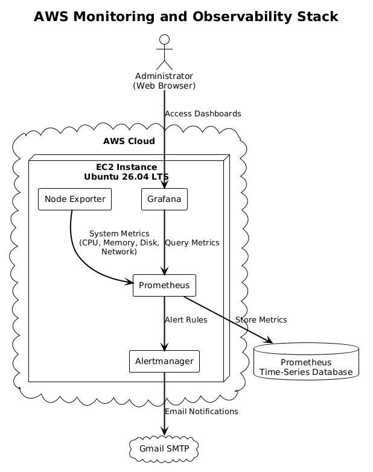

# Prometheus-Grafana Monitoring Stack on AWS


## Project Overview

This project demonstrates the deployment of a complete monitoring and observability stack on an AWS EC2 Ubuntu instance using Prometheus, Grafana, Node Exporter, and Alertmanager.

The monitoring stack continuously collects infrastructure metrics from the EC2 instance, stores them in Prometheus, visualizes system performance through Grafana dashboards, and sends automated email notifications using Alertmanager whenever configured alert thresholds are exceeded.

This project was developed to gain practical experience with cloud infrastructure monitoring, Linux server administration, observability, and modern DevOps practices.

---

## Key Features

- Deployed monitoring infrastructure on AWS EC2
- Configured Prometheus as the monitoring server
- Installed Node Exporter for Linux system metrics
- Built Grafana dashboards for infrastructure visualization
- Configured Alertmanager with Gmail SMTP for email alerts
- Monitored CPU, memory, disk, and instance availability
- Managed services using Linux systemd
- Configured AWS Security Groups and Elastic IP

---

## Technology Stack

| Category | Technology |
|-----------|------------|
| Cloud Platform | AWS EC2 |
| Operating System | Ubuntu 26.04 LTS |
| Monitoring | Prometheus |
| Dashboard | Grafana |
| Metrics Exporter | Node Exporter |
| Alerting | Alertmanager |
| Email Notifications | Gmail SMTP |
| Service Management | systemd |

---

## Architecture

The following diagram illustrates the architecture of the monitoring stack deployed on AWS.



---

## Monitoring Workflow

1. Node Exporter collects operating system metrics from the Ubuntu EC2 instance.
2. Prometheus scrapes metrics from Node Exporter at regular intervals.
3. Prometheus stores the collected metrics in its time-series database.
4. Grafana retrieves metrics from Prometheus to generate dashboards.
5. Prometheus evaluates alert rules continuously.
6. Alertmanager processes triggered alerts and sends email notifications through Gmail SMTP.

---

## Repository Structure

```text
prometheus-grafana-monitoring-on-aws/
│
├── configs/
│   ├── prometheus.yml
│   ├── alert_rules.yml
│   └── alertmanager.yml.example
│
├── docs/
│   ├── installation.md
│   ├── configuration.md
│   └── troubleshooting.md
│
├── images/
│   └── architecture.png
│
└── README.md
```

---

## Project Components

### Prometheus
Collects and stores time-series metrics from configured scrape targets.

### Node Exporter
Provides Linux system metrics such as CPU usage, memory utilization, disk usage, file system statistics, and network information.

### Grafana
Visualizes infrastructure metrics through customizable dashboards connected to Prometheus.

### Alertmanager
Handles alerts generated by Prometheus and delivers email notifications whenever configured alert rules are triggered.

---

## Documentation

Additional project documentation is available in the **docs** directory.

| File | Description |
|------|-------------|
| installation.md | Step-by-step deployment guide |
| configuration.md | Configuration of Prometheus, Grafana, Node Exporter, and Alertmanager |
| troubleshooting.md | Common deployment issues and their solutions |

---

## Challenges Encountered

During deployment, several practical issues were identified and resolved, including:

- AWS Security Group configuration for external access
- Grafana accessibility through the browser
- Prometheus target verification
- Gmail SMTP configuration for Alertmanager
- Linux service management using systemd
- EC2 resource limitations during deployment

---

## Skills Demonstrated

- AWS EC2 Deployment
- Linux Server Administration
- Infrastructure Monitoring
- Cloud Networking
- Prometheus Configuration
- Grafana Dashboard Development
- Alert Management
- Linux Service Management
- DevOps Troubleshooting

---

## Future Improvements

- Containerize the monitoring stack using Docker Compose
- Provision infrastructure using Terraform
- Automate deployment using Ansible
- Integrate Loki for centralized log management
- Configure HTTPS using Nginx Reverse Proxy
- Monitor multiple EC2 instances from a centralized Prometheus server

---

## License

This project is shared for educational and portfolio purposes.
